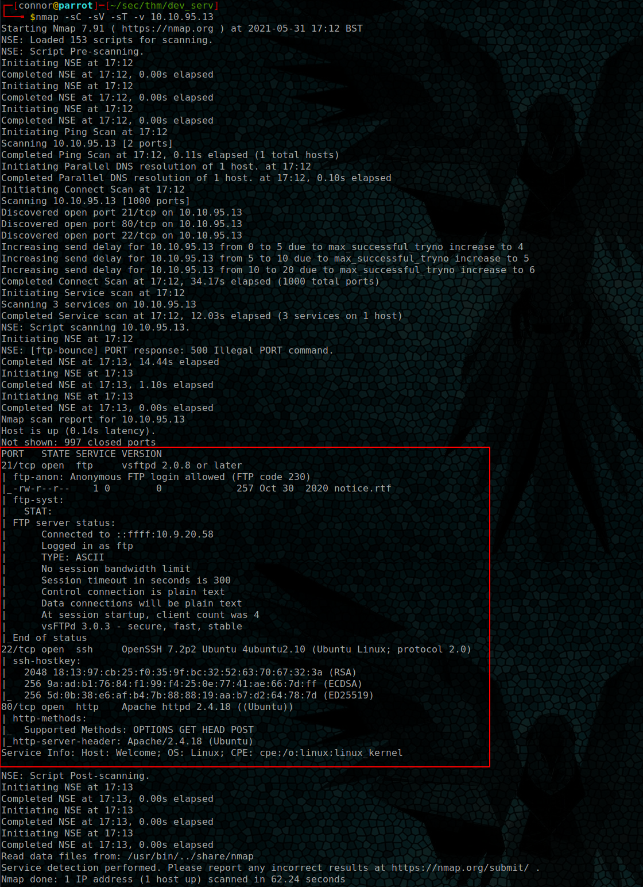
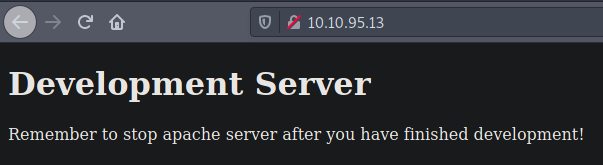
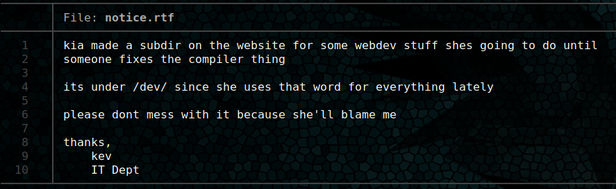
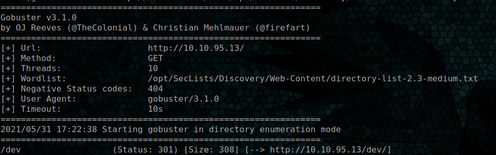
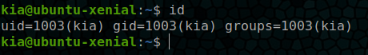
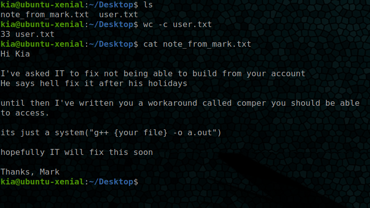
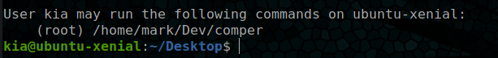
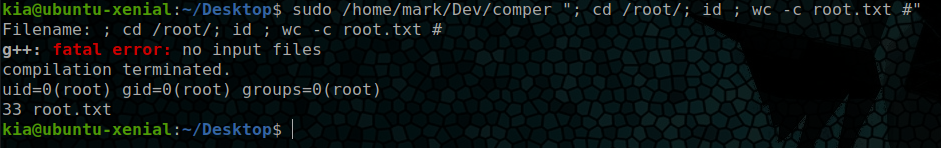

# DevServ Writeup - Connor Baxter

## Nmap scan

```bash
nmap -sC -sV -sT -v 10.10.95.13
```



We can see that the server is running SSH, FTP, and a web server.

---

## Gobuster

Browsing to the web server we see plain HTML.



We can now use Dirbuster/Gobuster to see what is stored here.

```bash
gobuster dir -u http://10.10.95.13/ -w /opt/SecLists/Discovery/Web-Content/directory-list-2.3-medium.txt
```

---

## FTP

While we wait for this to finish we can attempt to login to the ftp server.

```bash
ftp 10.10.95.13
```

We try the details ```anonymous``` with no password and see that anonymous login is enabled.
We can now ls the directory and see a file named ```notice.rtf```.
Using ```get notice.rtf``` we can download the file and read it.



This informs us of a sub-directory called /dev on the website.
We can also see this on the output of our Dirbuster/Gobuster session.



Navigating to this directory shows us a directory listing with a single HTML file with little content.

However moving back to the note we saw earlier plus this directory, we can assume a user account called ```kia``` exists.
We can also take a hint from 

> ..she uses this word for everything...

to assume that *dev* could be a potential password.

---

## SSH

Attempting to ssh to the user ```kia``` using the password ```dev``` allows us to connect to the machine as Kia.

```ssh kia@10.10.95.13```



We can now see 2 files in the *Desktop* directory, a user flag and a note from *mark*.



Reading the note from mark we can see that Kia is unable to compile c++ files.
A workaround has been used to allow for her to still accomplish this.

---

## Rooting

Running ```sudo -l``` we can see that user kia can run a file at ```/home/mark/Dev/comper``` as root.



We also have partial source code thanks to the note from mark, we can see that it runs a system command with user input.
Since this is a hacky workaround we can also assume that very little user input sanitation is being used.

We can compile code as root but it will only output a file and will not run the code, so malicious c++ code wont work as it'll still be run as kia.
However we can send a ; character to the program and likely be able to execute code this way.

Trying ```sudo /home/mark/Dev/comper "; id #"``` (The # is necessary to comment out everything after our command)

We can see that code is being executed as root.
We could now either attempt to drop into a shell or continue using this method.

We can send multiple ; per command so we can change directory to /root and ls by doing ```cd /root; ls;```
We can then continue to read the flag of the root user and complete the box

```sudo /home/mark/Dev/comper "; cd /root/; id ; wc -c root.txt #"```



---


